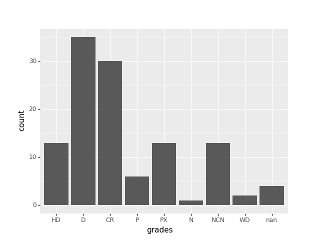
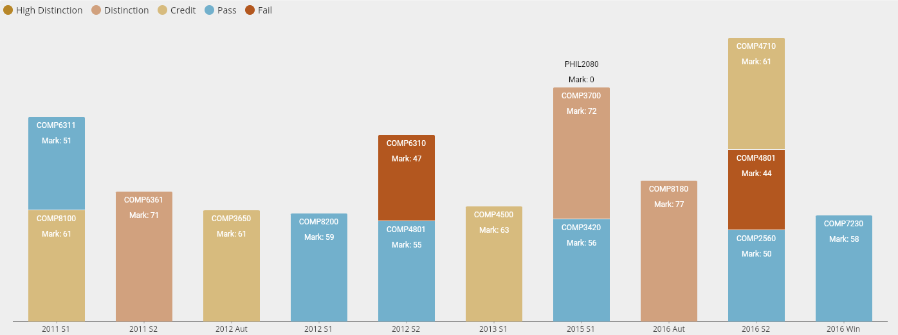

# FAIS Command Line Tool

The beginnings of a command line tool for FAIS (and Wattle and SAS).

To install:

```console
$ git clone https://github.com/anusii/faiscli.git
$ cd faiscli
$ make install
```

```console
$ fais --help
Usage: fais [OPTIONS] COMMAND [ARGS]...

  Access FAIS functionality from the command line.

Options:
  -d, --debug  Display the browser.
  -f, --fake   Return fake data.
  -h, --human  Pretty print for human consumption.
  --help       Show this message and exit.

Commands:
  courses     All courses and unit codes, useful for obtaining a unit code.
  enrolments  Students enrolled in a course.
  final       Students final grades for a course.
  function    Functions for --marks (int) and --grades (str).
  stats       Stats for final grades for a course.
  student     Student details.
  students    All current students.
```

Default output is **csv**. Use `-h` (`--human``) for output in tabular
form for human consumption and some graphics too for certain commands
(e.g., *final*).

Similarly for the **wattle** command line interface:

```console
$ git clone https://github.com/anusii/wattlecli.git
$ cd wattlecli
$ make install
```

```console
$ wattle --help
Usage: wattle [OPTIONS] COMMAND [ARGS]...

  Access WATTLE functionality from the command line.

Options:
  -d, --debug  Display the browser.
  -f, --fake   Return fake data.
  -h, --human  Pretty print for human consumption.
  --help       Show this message and exit.

Commands:
  marks  Wattle assessement for import into FAIS.

```

## Username/Password

Create environment variables to avoid repeated username/password:

```bash
export FAIS_USERNAME u1234567
export FAIS_PASSWORD mysecret
```

Or a text file `config.json` in the user's `~/.config/fais/` directory
(and be extra careful not to commit it into github - .gitignore will
ignore it for you):

```
{"username": "u1234567", "password": "mysecret"}
```

## Examples

Basic usage is to output as **csv**. To output in a more human readable
form, abbreviated to suit screen display use `-h` or `--human`.

**courses** mapping unit id, name, and title

List all FAIS course UnitIDs and the course name and title. FAIS
indexes course offerings by `UnitID`.

```console
$ fais courses | grep 3430
12886,COMP3430,Data Wrangling - S2/2021
12715,COMP3430,Data Wrangling - S2/2020
12252,COMP3430,Data Wrangling - S2/2019
11960,COMP3430,Data Wrangling - S2/2018
```

**enrolments** currently captured for a course in fais

List students enrolled in a course according to FAIS:

```console
$ fais --human enrolments 12886
Enrolments for COMP3430 - Data Wrangling: S2/2021

     Username        Name (s) Status Mark Grade                  Degree  Sp
0    u1184735  Julien Siestto   Norm          D                 InfTech    
1    u1129310   Heath Lionast   Norm         CR                 InfTech    
2    u1140576  Sandra Jeapese   Norm         NC                   BADAN    
3    u1146762       Owener Lu   Norm         PA                   BADAN    
4    u1186686        Laty Chu   Norm         DE                   BADAN    
..        ...             ...    ...  ...   ...                     ...  ..
[146 rows x 7 columns]
```

By default the output will be **csv**, suitable for further command
line processing.

**wattle marks** for fais upload

Extract the marks for an assessment from Wattle to a CSV file to load
into FAIS. The course code here (34101) is Wattle's unit id
corresponding to COMP3430 Sem 2 2021 and FAIS's 12886.

```console
$ wattle marks 34101 "Quiz 1"
u1375694,1.75,Fred Smith,
u3267832,3.45,Joy Adams,
u5632660,4.95,Kieth Trimmer,
u1234567,,Trimp Trump,
...
```

**final** grades for each student in a course

List the final FAIS marks and grades for a course. With `--human` the
output is in tabular form. By default the output is **CSV** which can
be post processed by, for example, *mlr*, or other command line tools.

Note that different course will have different collections of
assessment.

```
$ fais final 12886
Student,Fore/Last Names,Degree,Ass1,Ass2,Ass3,Ass4,FinalExam,Quiz1,Quiz2,Quiz3,Wattle,New Mark,New Grade,FAIS Mark,FAIS Grade,Seq.,Sp
u1234567,Mary Smithers,InfTech,9.10,10.95,19.00,none,44.38,4.00,4.50,5.00,none, , ,92,HD,21, 
u1234568,Howard Miller,InfTech,8.23,11.50,17.50,none,34.25,5.00,2.75,2.00,none, , ,87,HD,63, 
u1234569,Sally Meakiner,BADAN,3.22,12.00,11.00,none,35.90,4.00,4.50,4.00,none, , ,81,HD,36, 
...
```

TODO **marks**

```bash
fais marks 12886
```

```console
uid,name,course,Ass1,Ass2,Ass3,Ass4,Quiz1,Quiz2,Quiz3,Exam,Final,Grade,Comment
u1234567,Fred Smith,COMP8430,8.65,13.50,17.00,,4.50,5.00,2.00,22.11,80,HD,Top student.
...
```

```bash
fais marks 12886 u1234567
```

```console
uid,name,course,assessment,mark,total,weight,due,submitted,netered,marker,comment,feedback

```

**stats** for the final grades of a course

Summary of the course final marks and grades statistics.

```console
$ fais stats 12886
Final Marks and Grades for COMP3430 - Data Wrangling: S2/2021

Mark Statistics
           count  mean  std  min  25%  50%  75%  max
FAIS Mark    117    51   32    0    0   66   72   90

Distribution of Grade Counts
            HD   D  CR  P  PX  N  NCN  WD
FAIS Grade  13  35  30  6  13  1   13   2

Distribution of Grade Percentages
            HD   D  CR  P  PX  N  NCN  WD
FAIS Grade  12  31  27  5  12  1   12   2
```
The following distribution plot is also generated, displayed, and can
be saved to file:



**student** course enrolments and grades

Display the courses a student has taken and their final marks and
grades:

```
$ fais --human student u1234567
Details for student: u1234567 -  Cathey Togo - F - MComp

      Course                                        Description Sem/Year Status Grade Final Comment
0   COMP2700                        Cyber Security Fundamentals  S2/2021           HD    89        
1   COMP4550                Advanced Computing Research Project  S2/2021           KU              
2   COMP3600                                         Algorithms  S2/2021           CR    61        
3   COMP2400                               Relational Databases  S2/2021     UN                    
4   COMP3310                                  Computer Networks  S1/2021           CR    61        
5   COMP4450                Advanced Computing Research Methods  S1/2021            D    72        
6   COMP2310                   Systems Networks and Concurrency  S1/2021            P    57        
7   COMP4691                                       Optimisation  S1/2021           CR    62        
8   COMP4650                                  Document Analysis  S2/2020           CR    61        
9   COMP2300        Computer Organisation and Program Execution  S2/2020           HD    85        
10  ENGN4528                                    Computer Vision  S2/2020            D    75        
11  COMP2100                      Software Design Methodologies  S2/2020           HD    81        
12  COMP1110                             Structured Programming  S1/2020           CR    63        
13  COMP3620                            Artificial Intelligence  S1/2020           CR    61        
14  COMP4660  Neural Networks, Deep Learning and Bio-inspire...  S1/2020           CR    61        
15  COMP4670                       Statistical Machine Learning  S1/2020           CR    67        
16  COMP2620                                              Logic  S2/2019            D    77        
17  COMP2120                               Software Engineering  S2/2019            D    71        
18  COMP3670                   Introduction to Machine Learning  S2/2019           HD    93        
19  ENGN4528                                    Computer Vision  S1/2019     UN                    
20  COMP2420  Introduction to Data Management, Analysis and ...  S1/2019            P    55        
21  COMP1100                     Programming as Problem Solving  S2/2018           HD    87        
22  COMP1600                           Foundations of Computing  S2/2018            D    71        
23  COMP1730                         Programming for Scientists  S2/2018     UN                    
24  COMP2610                                 Information Theory  S2/2018            P    53        
```

*TODO*

Refinements to the output

* The Comment should include any special conditions.

A plot is also generated, displayed, and can be saved, showing the students
timeline history of subjects.



Other options that could be implemented:

```console
$ fais student --detail COMP3430 u1234567   # Show the course details for student.
$ fais student --special COMP3430 u1234567  # Show any special requests.
```

**students** mapped to university id and name

To look up a students UID, you can use the **students** command:

```console
$ fais -f students
UID,Fore,Last,Sex,Degree
u1234567,Deshayla,Chaniah,NA,MADAN
u1234568,Adelya,Lilias,NA,InfTech
u1234569,Myiesha,Quillian,NA,Engineer
u1234560,Sailee,Darsy,NA,FDD Eng. & Adv. Comp.
u1234561,Artia,Jaysson,NA,BPPE
u1234562,Kyniah,Avontae,NA,FDD Eng. & Adv. Comp.
u1234570,Adabella,Sheryce,NA,Engineer
u1234571,Ludy,Shalva,NA,CADAN
u6543432,Xyriah,Barris,NA,
u4546332,Yangqi,Yu,NA,BIT
u7543364,,Norden,NA,MADAN
u4323445,Alexander,Watt,NA,BA/BSc
```

To identify particular students use a pipeline:

```console
$ fais students | grep -i tommy
u1234567,Tommy,Jacson,M,BAC
u2345678,Tommy,Stalone,M,Engineer
u3456789,Tommy,Risenen,F,PhB(Hons)/BSc(Hons)
```
